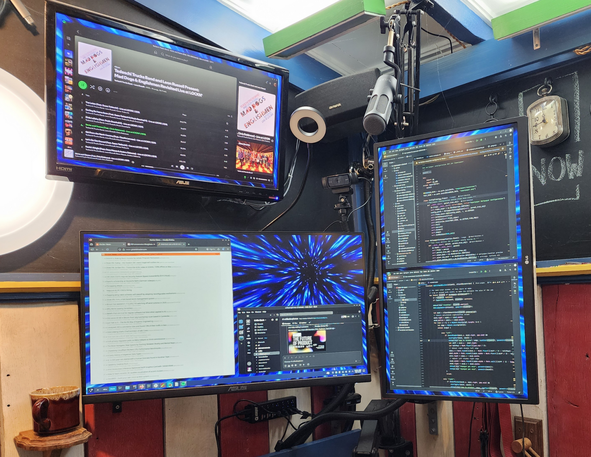

## TL;DR
Current hardware limits concurrent LLM development. Upgrading storage (3x faster),
migrating to Arch Linux (stability), and planning new build with 256GB RAM, faster
CPU, and exploring AMD GPUs for better VRAM/$ ratio.

# The Challenge: Running Multiple LLMs Concurrently

My recent work with local LLMs has revealed practical limitations in my development
setup. In my [pgvector demo](/posts/notes/post-2-demo-pgvector-2025082001/), I ran
into RAM exhaustion when loading multiple models simultaneously, and I've
continued to bump into the rails of GPU memory management experimenting with DSPy.

For the prompt optimization experiments I'm pursuing, I need to run:
* Embedding models for vector generation (e.g., text-embedding models)
* Small inference models for rapid prototyping (Qwen-1.5B, Phi-3)
* and the largest models I can manage for quality comparison evals.

The pair of RTX 3060s I picked up on eBay last year just isn't cutting it. With
8GB VRAM each, I can run a Qwen 1.5B model comfortably, but running larger models
has been tough.

Running on the CPU is painfully slow and my system is both dated and unoptimized for
my new AI hobby.

## The Solution: A New Build
I'm going to build a new PC and try to optimize for performance in a way that doesn't
sacrifice capability or cost more than I'm willing to spend.

So I'm going for an AMD Ryzen 9 9950X with 256GB RAM and a 13,400 MB/s SSD.  I'm also
going to try running vLLM with the Radeon 580 that got displaced by the 3060s and, if
I can get it working, I'm going to look at the 32GB AMD video cards.  They are
considerably cheaper than the NVIDIA cards.

As I explored in my [recent post on resource management](/posts/notes/post-4-next-ai-demo/),
managing different profiles that balance VRAM, context length, and concurrent model loading
in different ways is turning out to be table stakes for building anything interesting, but
things get a lot easier with more available VRAM.

# Hardware Upgrade Path

## Storage: The Unexpected Bottleneck

While researching components for a new build, I discovered my current NVMe SSD was capped at
2400MB/sec.  Current PCIe 4.0 drives that my motherboard supports are hitting 7000MB/sec.

Storage bandwidth matters. A $250 upgrade to a 2TB PCIe 4.0 drive effectively triples
sequential throughput while doubling capacity. For workflows that repeatedly load models
from disk, this is a meaningful improvement.

I'm resolved to maximize the performance of the SSD in the new build and I've found a
new 4TB M.2 drive with a 13,400 MB/s transfer speed to do just that.

## Planning for Scale

The goal is infrastructure that supports the experiments outlined in my upcoming demos:
running multiple models simultaneously, testing hybrid VRAM/RAM configurations, and
supporting longer context windows without slamming into memory barriers.

As the new workhorse, this build will focus on:
* More VRAM capacity for concurrent model loading
* More system DRAM running as fast as possible (256GB)
* High-bandwidth NVMe storage for model loading

# Development Environment Upgrade: Linux Infrastructure

With the new SSD in hand for my current workstation (a bit of a preview of toys to come),
this was an opportune moment to address a persistent development environment issue.

## The Stability Problem

My primary development system ran Ubuntu 24.04 LTS with KDE Plasma 5, which had become
increasingly unstable. I'm not sure if it was related to the inference experimentation or
just buggy drivers, but having all the menu dropdowns in my desktop environment go black
in the middle of the day is just not acceptable.

After evaluating several distributions, I migrated to Arch Linux, in no small part to try
out KDE Plasma 6.

**Why Arch for AI development:**
* Plasma 6 with Wayland is supposed to be more stable.
* Rolling release model should make it easier to keep up with the latest software, which
  seems important given that AI tooling has to be aging faster than any other category of
  software.
* AUR provides easy access to specialized tools (vLLM, various Python ML packages).
* Pacman's dependency management avoids the snap/flatpak complications I've encountered
  on Ubuntu.

The installation process was non-trivial (Arch's manual setup is definitely not streamlined),
but the resulting system has so far been rock-solid for development work.

# Workspace Ergonomics: A Brief Tangent

With a stable foundation in place, I encountered an unexpected friction point: window
management ergonomics.

## Visual Density and Cognitive Load

My workflow typically involves:
* IDE (PyCharm with split editors for model code and prompts)
* Multiple terminal windows (log tails, virtualenvs, git repositories)
* Browser tabs (documentation, dashboards, etc.)
* Note-taking application (experiment logs, parameter tracking, todo lists)

Without visual separation between windows, my attention stumbles from one application to
the next, especially when dark mode makes it even more difficult to track the boundaries.
Frankly, it's a bit jarring to switch between applications and windows without the clear
separation.

But the KWin window gaps script I had relied on in Plasma 5 was abandoned.

## Quick Fixes: Forking and Adapting

I forked two projects to solve immediate workflow issues:

**Window Gaps for Plasma 6:** Merged an outstanding PR and fixed some edge cases in the
tiling mathematics. Added logic to detect window dragging events, which resolved a
long-standing bug where other windows would resize unexpectedly during drag operations.

**SuperPaper for multi-monitor wallpapers:** Used PyCharm's AI assistant to adapt this
tool for my specific multi-monitor setup with activity-specific wallpaper configurations.
This makes it really easy to tell which activity you're working in and with the Window
Gaps layout, it's visually stunning.

Both of these were relatively minor modifications (a few hours of work), but the
ergonomic improvement was substantial. When you're context-switching between model
configurations, query results, and code multiple times per hour, reducing visual
friction adds up.

# Development Infrastructure Results

The combined upgrades have tangibly improved my AI development workflow:

**Storage performance:** Model loading times reduced significantly. vLLM's model
caching is noticeably snappier, and Docker container startup times for my
PostgreSQL/pgvector stack are much improved.

**System stability:** No more desktop environment crashes.

**Workspace clarity:** The visual separation between windows and the visual cues
for the activities reduces cognitive load when context switching.

# Next Steps
Now that my main workstation is a little bit faster and a lot more stable, I'm ready for
phase two of my AI development infrastructure upgrade:

* a new AM5 PC built for speed
* a KVM switch to quickly switch machines when needed
* and I'll be bringing my Framework 13 laptop into the mix to take advantage of its
  Ryzen 7040 that includes an AI NPU supported by Ryzen AI Engine (XDNA).

I'm excited to see how much more performant my pipeline experiments will be with the
addition of GPU capacity for larger models with the compute firepower for running
multiple small models at once.

DSPy's compilation approach uses larger models to iteratively optimize prompts and
workflows for smaller models, improving their performance through automated refinement.

With DSPy's more efficient use of GPU resources and with significantly more GPU capacity
at the ready, I'm hoping to build a system that can perform reasonably well for the
advanced workflows I've been seeing in IDE-based AI assistants. Stitching together these
examples will be a good test of the infrastructure and an interesting challenge.

I've got a lot of build-time and wire organization efforts in my short term future,
but, long-term, I'm working toward a framework that will pair system designers with
domain experts for curation and feedback. So, first, I'm growing the AI lab, then it's
onward and upward to orchestrating inference, embedding, and agent tooling
in a multi-host environment.
